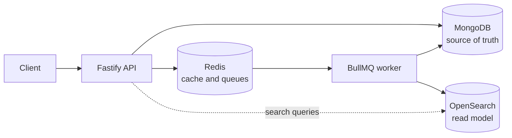

# TalentMatch

TalentMatch is a production-oriented backend for publishing jobs and matching candidates. It is intentionally structured as a modular monolith with two deployable processes: a synchronous Fastify API and an asynchronous BullMQ worker.

> Status: backend MVP complete. Job lifecycle, search, caching, idempotent applications, deterministic scoring, production observability, CI/CD, Docker, and AWS ECS configuration are implemented.

**Live demo:** [jobify.158-180-19-147.nip.io](https://jobify.158-180-19-147.nip.io) · [API docs](https://jobify.158-180-19-147.nip.io/docs) · [browser demo](https://jobify.158-180-19-147.nip.io/demo)
Runs the real Docker images on a self-hosted VM rather than the AWS ECS topology documented below — see [docs/deployment.md](docs/deployment.md#live-public-demo-as-actually-deployed) for exactly what differs and why.

## Architecture



MongoDB owns durable domain state. OpenSearch is a rebuildable read model and is never treated as authoritative. Redis is deliberately shared for queues and short-lived search caching to keep the MVP operationally small. API and worker are separate processes so HTTP traffic and background workloads can scale independently without introducing unnecessary microservices.

See [docs/architecture.md](docs/architecture.md) for boundaries, runtime flows, and trade-offs.
See [docs/deployment.md](docs/deployment.md) for ECS provisioning and [docs/operations.md](docs/operations.md) for monitoring and incident procedures.

## Repository layout

```text
apps/
  api/          HTTP transport, application composition, infrastructure adapters
  worker/       background processor composition and lifecycle
packages/
  config/       validated environment configuration
  logger/       structured and redacted JSON logging
  shared/       cross-process contracts and domain-neutral errors
  validation/   reusable Zod schemas and parsing helpers
docs/           architecture and engineering decisions
infrastructure/ Docker images and parameterized AWS ECS/Fargate configuration
```

## Prerequisites

- Node.js 22
- pnpm 10.12.1 (Corepack can provision it)
- Docker with Compose v2

## Local development

```bash
corepack enable
pnpm install
cp .env.example .env
docker compose up -d mongodb redis opensearch
pnpm dev:api
```

The API listens on `http://localhost:3000`. Interactive OpenAPI documentation is available at `http://localhost:3000/docs`.
For a browser-based walkthrough of the complete workflow, open `http://localhost:3000/demo` and select **Run full demo**. The demo page is enabled by `ENABLE_DEMO=true` and is automatically disabled when production OIDC authentication is enabled.

```bash
curl -i http://localhost:3000/health/live
curl -i http://localhost:3000/health/ready
curl http://localhost:3000/metrics
```

The liveness probe only proves that the process can serve HTTP. Readiness independently checks MongoDB, Redis, and OpenSearch with bounded timeouts and returns `503` when any dependency is unavailable.

To build and run the containerized API and outbox relay with all dependencies:

```bash
docker compose up --build api worker
```

## Jobs API

Create a draft:

```bash
curl -X POST http://localhost:3000/v1/jobs \
  -H 'content-type: application/json' \
  -H 'x-development-subject: employer-123' \
  -H 'x-development-role: employer' \
  -d '{
    "title": "Senior Backend Engineer",
    "description": "Build and operate dependable distributed backend services.",
    "city": "Vienna",
    "remote": true,
    "skills": ["TypeScript", "Node.js", "MongoDB"],
    "salary": { "min": 80000, "max": 105000, "currency": "EUR" }
  }'
```

```bash
curl http://localhost:3000/v1/jobs/{jobId}
curl -X POST http://localhost:3000/v1/jobs/{jobId}/publish
curl -X DELETE http://localhost:3000/v1/jobs/{jobId}
```

Create returns `201` with a `Location` header, publish returns the transitioned resource, and delete returns `204`. Publishing is guarded so only a draft can transition to published; a repeated or invalid transition returns `409`.

## Search API

Only published jobs are indexed. Search supports fuzzy keyword matching plus structured filters:

```bash
curl -i 'http://localhost:3000/v1/jobs/search?keyword=bakend&city=vienna&remote=true&skills=typescript,mongodb&salaryMin=80000&page=1&limit=20&sort=newest'
```

Supported sort values are `relevance`, `newest`, `salary_asc`, and `salary_desc`. Salary bounds use range overlap: `salaryMin` requires a job's maximum to reach that amount, while `salaryMax` requires its minimum not to exceed that amount. Pagination returns `items`, `total`, `page`, `limit`, and `pages`.

Search responses include `X-Cache: MISS` or `X-Cache: HIT`. Cached results expire after 120 seconds by default.

```bash
curl 'http://localhost:3000/v1/jobs/autocomplete?prefix=Back&limit=10'
```

Autocomplete uses OpenSearch `search_as_you_type` fields and deduplicates titles.

Rebuild the OpenSearch projection from published MongoDB jobs while the worker is running:

```bash
pnpm reindex
```

When using Docker Compose, run the same rebuild inside the worker container:

```bash
pnpm reindex:docker
```

The command drops and recreates the search index with the correct mappings, then sends every published job through the normal BullMQ indexing path. In Dev Tools or OpenSearch Dashboards, query index `talentmatch-jobs-v2` (not `v1`).

### OpenSearch Dashboards (`http://localhost:5601`)

Job documents are **not** on the default Discover view until you configure a data view:

1. Open **Dev Tools** and confirm data exists:
   ```http
   GET talentmatch-jobs-v2/_search
   ```
2. Go to **Stack Management → Data views → Create data view**.
3. **Name:** `TalentMatch jobs` · **Index pattern:** `talentmatch-jobs-v2` · **Timestamp field:** `@timestamp` (or `publishedAt` on older projections).
4. After creating the view—or whenever the index was recreated—open the data view and choose **Refresh field list** (otherwise Discover can show an empty **Available fields** panel).
5. Open **Discover**, pick that data view, and set the time range to something wide (for example **Last 7 days**).

Or run the automated setup (creates the data view, refreshes fields, sets the default):

```bash
pnpm dashboards:setup
```

If **Available fields** is still empty, delete any data view pointing at `talentmatch-jobs-v1`, recreate the view for `talentmatch-jobs-v2`, and run `pnpm reindex:docker` so documents and mappings stay in sync.

Inspect dead-letter queues without mutating them:

```bash
pnpm dlq index --limit=100
pnpm dlq score --limit=100
```

After fixing the underlying cause, add `--execute` to replay. The command preserves event IDs, removes only exhausted source jobs, safely resumes after crashes, validates stored command shapes, and removes DLQ copies only after the source command is scheduled or already completed.

## Applications and matching

Applications require an `Idempotency-Key` header:

```bash
curl -i -X POST http://localhost:3000/v1/jobs/{jobId}/applications \
  -H 'content-type: application/json' \
  -H 'idempotency-key: candidate-123-job-456-v1' \
  -H 'x-development-subject: candidate-123' \
  -H 'x-development-role: candidate' \
  -d '{
    "skills": ["TypeScript", "Node.js", "MongoDB"],
    "experienceYears": 5,
    "city": "Vienna",
    "remote": true,
    "salaryExpectation": 95000
  }'
```

The first accepted request returns `202` and `Idempotent-Replayed: false`. Repeating the identical request and key returns the original application with `200` and `Idempotent-Replayed: true`. Reusing the key with different input returns `409`. A database uniqueness constraint also prevents a candidate from applying twice to the same job under different keys.

Scoring runs asynchronously. Poll the returned `Location`:

```bash
curl http://localhost:3000/v1/applications/{applicationId}
```

The status progresses from `scoring` to `scored`, or to `score_failed` after all retries are exhausted. A completed result includes:

```json
{
  "score": {
    "score": 80,
    "matchedSkills": ["node.js", "typescript"],
    "missingSkills": ["mongodb"],
    "breakdown": {
      "skills": 40,
      "experience": 10,
      "location": 20,
      "salary": 10
    }
  }
}
```

The score is deterministic: skills contribute 60 points, location 20, salary compatibility 10, and experience currently contributes a documented neutral 10-point placeholder because jobs do not yet define required experience.

## Authentication and authorization

Production uses OIDC bearer JWTs verified against a remote JWKS. Tokens require a `sub` claim and either a `roles` array or `role` string containing `employer` or `candidate`.

- Employers can create jobs and mutate only jobs whose owner was derived from their token subject.
- Candidates apply under their token subject and can read only their own applications.
- Job detail, search, autocomplete, and health remain public. Metrics are blocked publicly by the production ALB.

Set `AUTH_ENABLED=true` with `OIDC_ISSUER_URL`, `OIDC_AUDIENCE`, and `OIDC_JWKS_URL`. Local development defaults to disabled verification and accepts `X-Development-Subject` and `X-Development-Role`; these headers are ignored when OIDC verification is enabled.

## Rate limiting

Production applies a Redis-backed fixed-window quota, defaulting to 100 requests per actor/IP per 60 seconds. Authenticated actor material is SHA-256 hashed before becoming part of a Redis key. Responses include `X-RateLimit-Limit`, `X-RateLimit-Remaining`, and `X-RateLimit-Reset`; rejected requests return `429` with `Retry-After`. Health and metrics probes are excluded. The limiter fails open during Redis errors so an infrastructure incident does not turn into a complete API outage.

## Quality checks

```bash
pnpm lint
pnpm typecheck
pnpm test
pnpm build
```

Run the real MongoDB repository integration suite while local MongoDB is available:

```bash
RUN_INTEGRATION=true pnpm vitest run apps/api/src/modules/jobs/adapters/mongo-job-repository.integration.test.ts
RUN_SEARCH_INTEGRATION=true pnpm vitest run apps/api/src/modules/search/adapters/search-infrastructure.integration.test.ts
RUN_INTEGRATION=true pnpm vitest run apps/api/src/modules/applications/adapters/mongo-application-repository.integration.test.ts
RUN_INTEGRATION=true pnpm vitest run apps/worker/src/application-scorer.integration.test.ts
```

CI performs all checks on Node.js 22 and provisions MongoDB for this integration suite. Unit and API tests inject ports so failure paths remain fast and deterministic.

## Reliability and security baseline

- Environment variables are validated once at startup; invalid configuration fails fast.
- Every response includes `X-Request-Id`; a valid caller ID is propagated for trace correlation.
- Completion logs include request ID, method, URL, status, and elapsed time.
- Sensitive authorization and cookie headers are redacted from structured JSON logs.
- Error responses have a stable envelope and do not expose stack traces.
- API shutdown stops accepting traffic before infrastructure clients close, with a hard deadline.
- Readiness checks execute concurrently with individual timeouts.
- HTTP requests have bounded duration and body size; framework 4xx errors use the public error envelope.
- Prometheus metrics use bounded route labels rather than raw URLs.
- Publish and delete atomically store an index-delivery marker with the MongoDB state change.
- BullMQ commands use the marker's event UUID as their job ID, making relay retries idempotent.
- Soft-deleted tombstones preserve delete commands until Redis acknowledges delivery.
- Index workers reload canonical MongoDB state rather than trusting event payloads.
- Indexing uses five exponential-backoff attempts; exhausted jobs are retained and copied to `job-indexing-dead-letter`.
- Search cache keys include a Redis generation number, so invalidation is constant-time without key scans.
- Cache invalidation occurs immediately after job mutation and again after OpenSearch convergence.
- Application idempotency and one-application-per-candidate/job rules are enforced by MongoDB unique indexes, not only service checks.
- Score events use the same atomic marker and deterministic BullMQ delivery pattern as search indexing.
- Exhausted scoring jobs are retained, copied to `application-scoring-dead-letter`, and surfaced as `score_failed`.

## Deployment strategy

API and worker build as separate immutable images and deploy as independent ECS Fargate services. The supplied CloudFormation stack configures private tasks, HTTPS ALB routing, health checks, Secrets Manager injection, task-role OpenSearch signing, autoscaling, Container Insights, alarms, and deployment rollback. GitHub Actions uses OIDC and immutable commit-SHA images. MongoDB remains an explicit external choice because DocumentDB compatibility must be measured rather than assumed.

## Known limitations

- OIDC roles use fixed `role`/`roles` claims; providers with namespaced claims require a mapping adapter.
- Experience scoring is intentionally neutral until jobs gain an explicit experience requirement.
- There is no update-job endpoint yet; it must use the existing cache-generation invalidation when added.
- The reindex command clears the live index before repopulating it, so large datasets would require a versioned-index and alias-swap strategy.
- Offset pagination is capped to OpenSearch's 10,000-result window. Deep pagination should move to `search_after` cursors.
- Local OpenSearch disables its security plugin; production must use TLS, authentication, and network isolation.
- Caller-provided request IDs are bounded but trusted for correlation; an edge gateway should overwrite them in a public deployment.
- Distributed tracing, endpoint-specific quotas, and BullMQ queue-age metrics are future improvements.

## Planned milestones

1. Platform foundation (complete)
2. Job lifecycle in MongoDB with reliable indexing commands (complete)
3. OpenSearch indexing, reindexing, search, autocomplete, and Redis cache (complete)
4. Idempotent applications and deterministic candidate scoring (complete)
5. ECS definitions, deployment documentation, metrics, and operational hardening (complete)
