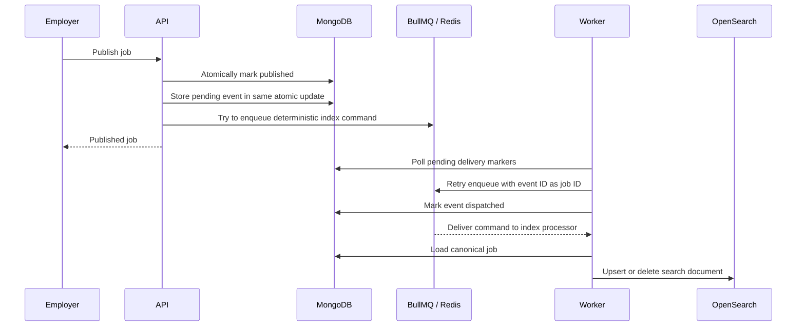
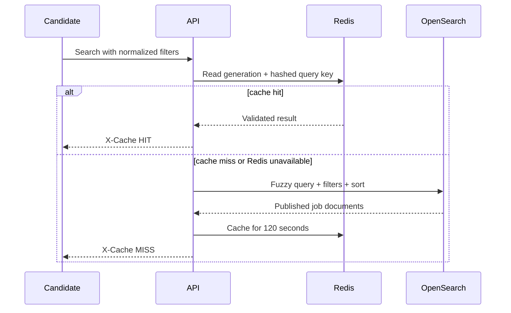
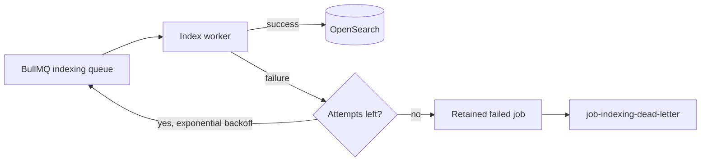
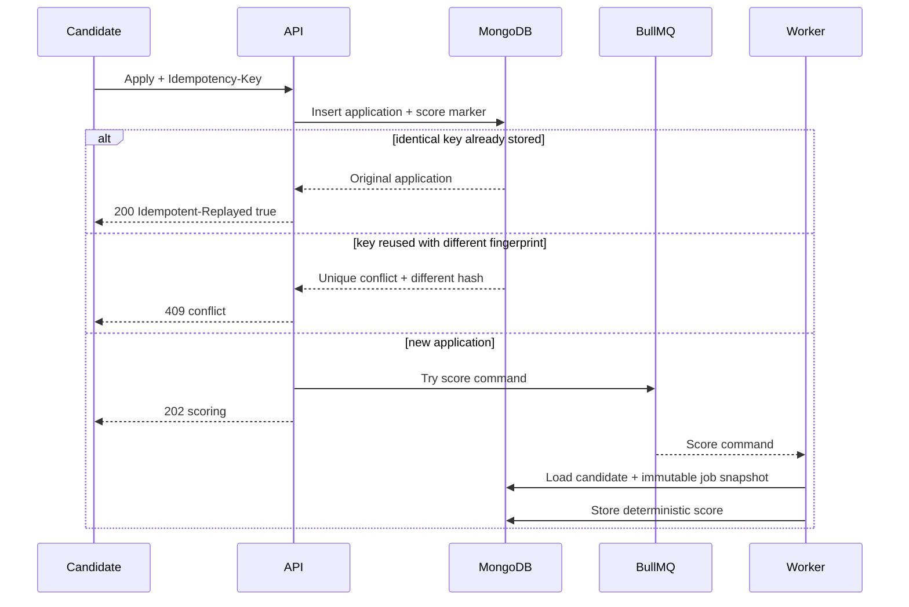
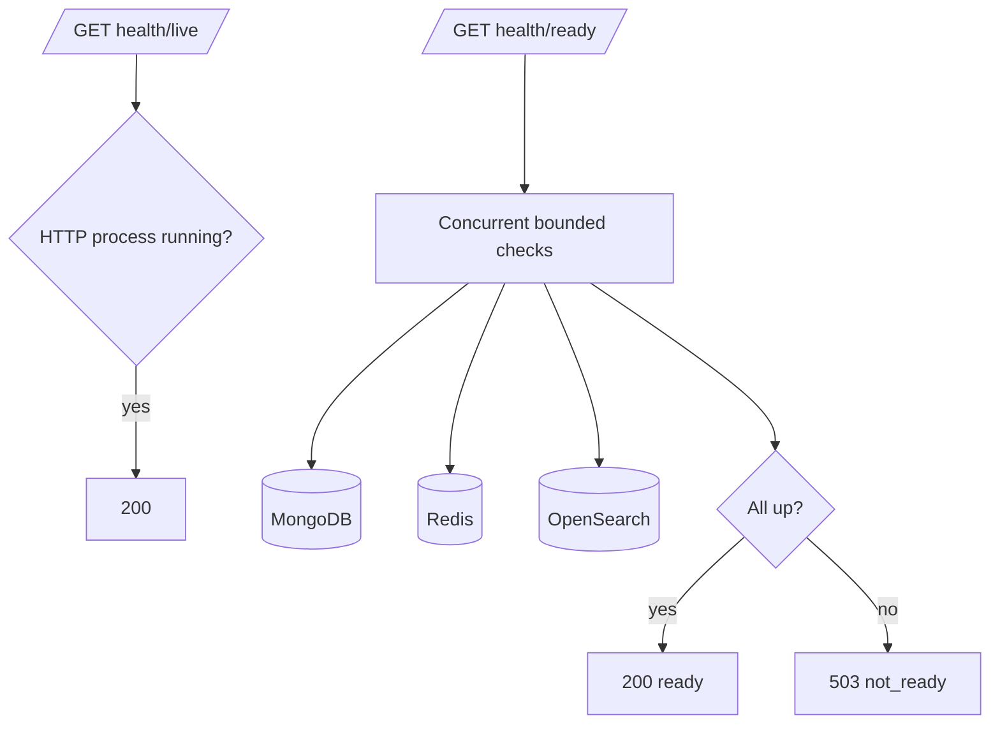

# Architecture

## System context

TalentMatch is a modular monolith split by execution model rather than by business entity. The API owns synchronous use cases; the worker owns retryable asynchronous effects. Both consume the same domain and infrastructure contracts from workspace packages.



Writing MongoDB and Redis cannot be atomic. Publish and delete therefore write an `indexSync` marker in the same MongoDB document update as the state transition. The API tries immediate delivery for low latency. If enqueueing or acknowledgement fails, the worker relay discovers the pending marker and retries. BullMQ uses the event UUID as its job ID, so a crash between enqueue and acknowledgement does not create a second logical job.

Delete is implemented as a tombstone. This is not merely an audit choice: hard deletion could erase the only durable record of an undelivered OpenSearch delete command. Public reads exclude tombstones.

The embedded marker intentionally stores only the latest desired index effect. A publish immediately followed by delete may supersede an undelivered upsert, which is safe because OpenSearch should converge to absence. This compact approach fits one search projection; multiple independent consumers would justify a separate transactional outbox collection.

## Search read path and cache coherence



Search cache invalidation increments `search:version`; query keys include that version. Old entries expire naturally and are immediately unreachable, avoiding unsafe Redis `KEYS` scans. Mutation-time invalidation prevents serving the previous projection while an event waits. The index worker invalidates again after OpenSearch succeeds, preventing a query in the asynchronous gap from remaining cached.

OpenSearch documents contain only published searchable fields. The index worker loads the current MongoDB record for every upsert command. If an old upsert arrives after the job was deleted, the worker deletes the search document instead, making processing order tolerant and convergent.

## Indexing failure lifecycle



Failed source jobs remain in BullMQ and a diagnostic copy is placed on the dead-letter queue after the fifth attempt. Logs include BullMQ job ID, job name, attempt, duration, and the structured error. Replaying a DLQ entry is safe because OpenSearch upserts and deletes are idempotent and the worker always rereads MongoDB.

## Idempotent application flow



The unique `(candidateId, idempotencyKey)` index is the concurrency boundary. A SHA-256 fingerprint distinguishes a legitimate replay from accidental key reuse with different input. A second unique `(jobId, candidateId)` index enforces the business rule that one candidate applies once per job even when clients generate a new key.

The application document stores the job fields required for scoring. This creates an intentional historical snapshot: a score represents the published requirements at application time and does not change if the job later changes or is deleted. It also prevents an asynchronous worker from failing because the source job disappeared.

Scoring commands use an embedded durable marker, immediate enqueue, worker relay, deterministic BullMQ job ID, five retries, and a dedicated DLQ. Completion updates require both `status: scoring` and the matching event ID, making duplicate delivery harmless.

## Deterministic matching

| Component | Weight | Rule |
| --- | ---: | --- |
| Skills | 60 | Proportion of required job skills present in the normalized candidate set |
| Experience | 10 | Neutral placeholder until jobs specify required years |
| Location | 20 | City matches, or both job and candidate allow remote work |
| Salary | 10 | Candidate expectation does not exceed the job maximum |

Matched and missing skills are sorted, making the output stable regardless of request ordering. No model, external AI service, or probabilistic behavior participates in scoring.

## Identity boundary

Production requests authenticate with OIDC bearer JWTs. Signature, issuer, audience, and token lifetime are verified through the provider's JWKS. The token subject becomes the immutable employer or candidate ID; clients cannot submit identity fields in job or application payloads.

Authorization remains close to the use case: employer mutations verify job ownership, while candidates can retrieve only applications whose stored candidate ID matches their subject. Public job discovery stays anonymous. Local development has an explicit verification-disabled mode with development identity headers; the ECS definition always enables OIDC verification.

Rate limiting runs before authentication and combines the trusted proxy-derived client IP with a hash of bearer-token or development identity material. A Redis Lua script atomically increments the window counter and establishes its expiry across every API task. Health and metrics paths bypass quotas. Redis errors fail open and emit warnings: availability is preferred because protected routes still perform cryptographic authentication and authorization.

## Package boundaries

- `apps/api`: Fastify routes, transport error mapping, dependency composition, and process lifecycle.
- `apps/worker`: BullMQ processor composition and process lifecycle.
- `packages/config`: environment schema and startup validation. It does not read configuration at module import time.
- `packages/logger`: Pino construction, common metadata, and secret redaction.
- `packages/shared`: stable domain-neutral contracts used across deployables.
- `packages/validation`: reusable boundary schemas. Feature-local schemas remain near their routes.

Controllers will parse transport input and call application services. Services depend on repository and queue ports, while adapters implement those ports with MongoDB, Redis/BullMQ, and OpenSearch. This keeps business rules testable without network services while avoiding abstract interfaces that have no real substitution point.

## Health semantics



Liveness deliberately excludes external dependencies so an outage does not cause restart loops. Readiness removes an unhealthy task from traffic while preserving the process for diagnosis and recovery.

## Error contract

```json
{
  "error": {
    "code": "VALIDATION_ERROR",
    "message": "Request validation failed",
    "requestId": "01-example",
    "details": [{ "field": "body.title", "message": "Required" }]
  }
}
```

Known application errors map to explicit HTTP statuses. Unknown exceptions are logged internally with the request context and returned as a generic `INTERNAL_ERROR`.

## Decisions and trade-offs

### Two deployables, one codebase

Separating worker and API protects request latency and allows independent scaling. A pnpm monorepo retains atomic changes and avoids the operational burden of service-per-domain deployments.

### Infrastructure clients connect before listen

The API fails startup when required clients cannot connect rather than briefly advertising readiness with a broken dependency graph. Once running, readiness detects later failures. This is appropriate for an ECS service whose dependencies are mandatory for all planned use cases.

### OpenSearch as a read model

Search documents may lag MongoDB and can always be recreated. Job detail endpoints will read MongoDB so stale or missing index documents never redefine domain truth.

The current reindex command clears the live index and enqueues every published MongoDB ID. This is deliberately simple for MVP scale but creates a reduced-results window. Production-scale reindexing should build a versioned physical index, verify document counts, and atomically swap a read alias.

### Zod at trust boundaries

Environment and future endpoint payloads are parsed before use. TypeScript types alone provide no runtime safety; parsed outputs are the only values allowed into application services.

### Guarded atomic transitions

MongoDB updates include the expected current state in their filter. Concurrent publish requests cannot both transition a draft, and version numbers advance with every mutation. Services distinguish a missing resource from an invalid transition and map them to `404` and `409` respectively.
