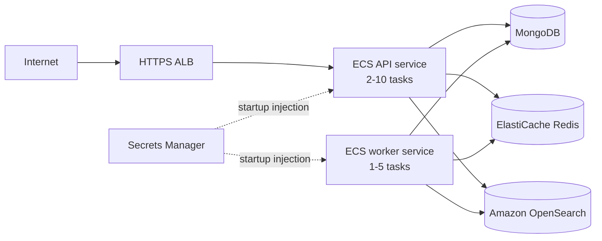

# Deployment

## Live public demo (as actually deployed)

The public instance at `https://jobify.158-180-19-147.nip.io` does not run
the AWS ECS topology below — that stack costs real money to keep running
and is documented as the production target, not the portfolio deployment.
The live demo instead runs the same Docker images on a single self-hosted
VM, the same free-tier host already used for this author's other public
demo:

| Component | Where | Setup |
|---|---|---|
| API + worker | Oracle Cloud Always Free Ampere A1 VM (Ubuntu, ARM64) | `docker compose -f docker-compose.prod.yml up --build`, same `infrastructure/docker/*.Dockerfile` images used locally |
| MongoDB, Redis, OpenSearch | Same VM, Docker Compose | Self-hosted single-node containers (`OPENSEARCH_JAVA_OPTS=-Xms512m -Xmx512m` to fit the VM's memory) rather than managed services — no always-on free managed OpenSearch tier exists |
| TLS / routing | Caddy (already running on the VM for the other demo) | An added Caddyfile site block reverse-proxies `jobify.<vm-ip>.nip.io` to `localhost:3000`; automatic Let's Encrypt, no purchased domain |
| Auth | `AUTH_ENABLED=false` | The live demo uses the development identity headers (`X-Development-Subject`/`X-Development-Role`) documented in the README; there is no public OIDC provider wired up for a portfolio demo |

This means the live demo is a real, working deployment of the actual
application code and Docker images — not a mock — just on cheaper
infrastructure than the ECS design below targets. The ECS/Fargate stack,
CloudFormation template, and GitHub OIDC deploy workflow remain the
documented answer for what running this in a funded production
environment looks like.

## AWS ECS deployment (documented production target)

The production topology uses two ECS Fargate services in private subnets. An HTTPS Application Load Balancer routes only to the API; the worker has no inbound listener. MongoDB, Redis, and OpenSearch remain managed external dependencies.



## Prerequisites

- A VPC spanning at least two Availability Zones.
- Public subnets for the ALB and private subnets for Fargate tasks.
- NAT gateways or the necessary VPC endpoints for ECR, CloudWatch Logs, Secrets Manager, and ECS control-plane traffic.
- Two ECR repositories containing the API and worker images.
- An ACM certificate for the public hostname.
- An SNS topic with confirmed operational subscribers.
- An OIDC provider with a JWKS endpoint, API audience, and `candidate`/`employer` role claims.
- MongoDB reachable from the task security group. MongoDB Atlas with private connectivity is the least surprising fit. DocumentDB compatibility, TLS CA packaging, index behavior, and MongoDB feature support must be tested before substitution.
- ElastiCache/Redis reachable from the task security group. Use a `rediss://` URI when in-transit encryption is enabled.
- An Amazon OpenSearch Service domain reachable from the tasks. The task role receives `es:ESHttp*` only for the supplied domain ARN, and the client signs requests using ECS task credentials when `OPENSEARCH_AWS_REGION` is set.

Store each dependency value as a raw Secrets Manager secret string:

- `MONGODB_URI`: complete connection URI.
- `REDIS_URL`: complete `redis://` or `rediss://` URI.
- `OPENSEARCH_NODE`: the domain HTTPS endpoint.

## Provisioning

[ecs-stack.yaml](../infrastructure/aws/ecs-stack.yaml) creates the cluster, task roles, task definitions, services, ALB, target group, security groups, autoscaling policies, log group, and baseline alarms. It deliberately does not create stateful databases or networking.

```bash
aws cloudformation deploy \
  --stack-name talentmatch-prod \
  --template-file infrastructure/aws/ecs-stack.yaml \
  --capabilities CAPABILITY_IAM \
  --parameter-overrides \
    EnvironmentName=talentmatch-prod \
    VpcId=vpc-example \
    PublicSubnetIds=subnet-public-a,subnet-public-b \
    PrivateSubnetIds=subnet-private-a,subnet-private-b \
    ApiImageUri=ACCOUNT.dkr.ecr.REGION.amazonaws.com/talentmatch-api:INITIAL_SHA \
    WorkerImageUri=ACCOUNT.dkr.ecr.REGION.amazonaws.com/talentmatch-worker:INITIAL_SHA \
    CertificateArn=arn:aws:acm:REGION:ACCOUNT:certificate/ID \
    MongoDbUriSecretArn=arn:aws:secretsmanager:REGION:ACCOUNT:secret:MONGO \
    RedisUrlSecretArn=arn:aws:secretsmanager:REGION:ACCOUNT:secret:REDIS \
    OpenSearchNodeSecretArn=arn:aws:secretsmanager:REGION:ACCOUNT:secret:OPENSEARCH \
    OpenSearchDomainArn=arn:aws:es:REGION:ACCOUNT:domain/talentmatch \
    AlarmTopicArn=arn:aws:sns:REGION:ACCOUNT:talentmatch-alarms \
    OidcIssuerUrl=https://identity.example.com/ \
    OidcAudience=talentmatch-api \
    OidcJwksUrl=https://identity.example.com/.well-known/jwks.json
```

The ALB uses readiness for target registration while the container health check uses liveness. This keeps dependency outages from causing restart loops but removes tasks with broken dependencies from public traffic.

## Continuous deployment

[deploy.yml](../.github/workflows/deploy.yml) authenticates to AWS through GitHub OIDC—no long-lived AWS keys—then:

1. Builds API and worker images tagged with the immutable commit SHA.
2. Pushes both images to ECR.
3. Copies each active task definition and replaces only its image.
4. Registers new task revisions.
5. Updates both ECS services and waits for stability.

Configure these GitHub environment variables:

- `AWS_DEPLOY_ROLE_ARN`
- `AWS_REGION`
- `ECR_API_REPOSITORY`
- `ECR_WORKER_REPOSITORY`
- `ECS_CLUSTER`
- `ECS_API_SERVICE`
- `ECS_WORKER_SERVICE`
- `ECS_API_TASK_FAMILY`
- `ECS_WORKER_TASK_FAMILY`

The OIDC deployment role needs scoped ECR push permissions, read/register permissions for the two task families, update/describe permissions for the two services, and `iam:PassRole` only for the task and execution roles.

ECS deployment circuit breakers automatically roll back tasks that fail to become healthy. To roll back an otherwise healthy but incorrect release, update each service to its preceding task-definition revision.

## Security posture

- Tasks receive no public IP and run as the image's non-root `node` user.
- Root filesystems are read-only and Linux capabilities are dropped.
- Runtime credentials are injected from Secrets Manager.
- OpenSearch requests use SigV4 task-role credentials.
- Only the ALB security group can reach API port 3000.
- Public `/metrics` traffic is rejected by an ALB listener rule; an internal collector needs an explicitly scoped security-group path.
- Swagger is disabled in production.
- OIDC verification is mandatory in ECS; development identity headers cannot bypass it.
- The ALB accepts TLS 1.2 and 1.3 and drops malformed headers.

## Scaling trade-offs

API tasks target 60% CPU and scale from 2 to 10. Worker tasks target 70% CPU and scale from 1 to 5. CPU is a reasonable baseline, but queue-age or queue-depth scaling is superior for BullMQ and should replace worker CPU scaling once those custom CloudWatch metrics are published.
